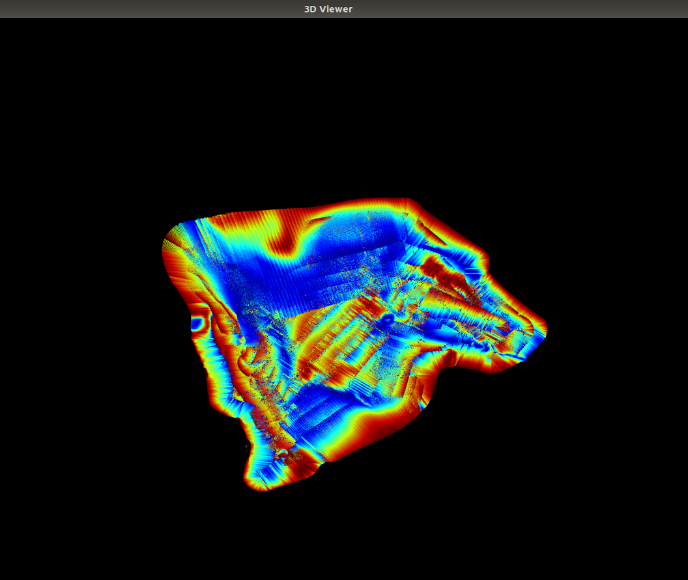

# SubmapsRegistration

Tools for keypoint detection, feature computation and correspondance matching in point clouds, with the focus on bathymetric data.


## Dependencies (Ubuntu 20.04)

*currently tested on 18.04*

* PCL  http://pointclouds.org/
```
sudo apt install libpcl-dev
```
* EIGEN http://eigen.tuxfamily.org/
```
sudo apt install libeigen3-dev
```
* Auvlib https://github.com/nilsbore/auvlib
```
sudo apt-get install libcereal-dev libglfw3-dev libtinyxml2-dev libboost-all-dev libopencv-dev xorg-dev
git submodule update --init
mkdir build
cd build
cmake -DCMAKE_INSTALL_PREFIX=../install -DAUVLIB_USE_LIBIGL_TINYXML=ON -DAUVLIB_USE_LIBIGL_GLFW=ON ..
```
and, e.g., 
```
export PYTHONPATH=$PYTHONPATH:/home/jiarui/library/auvlib/install/lib
export PATH=$PATH:/home/jiarui/library/auvlib/install/share
```
* ymal-cpp https://github.com/jbeder/yaml-cpp
```
sudo apt install libyaml-cpp-dev
```

## Building

Clone this repository and create a `build` folder under the root, then execute
```
cd build
cmake ..
make -j4
```

## Running
Available under the `bin` folder:

### Submap registration: One submap with a corresponding noisy submap

Registration of a pointcloud against itself after a random transformation
```
./submap_registration ../meshes/submap_1.pcd ../config.yaml
```
And hit 'q' on the window to go through the registration steps:
1. Keypoints extraction
2. Correspondance matching between the keypoints features
3. Initial alingment based on the correspondances
4. GICP registration
5. Exit

### Create submaps

Constructs submaps from a bathymetry survey with 'submap_size' pings per submap and saves them as 'pcd' files in the output folder
```
./submaps_construction --submap_size 200 --mbes_cereal /path/to/file.cereal --output_folder /path/to/output/folder
```
e.g.
```
//TODO
//need some .cereal files to start
//see src/feature_matching/src/create_submaps.cpp
```
Try this:
```
./submaps_construction --submap_size 200 --mbes_cereal ../data_cereal/mbes_pings_33.cereal --output_folder ../data_pcd
```
p.s.
MBES = multibeam echosounder

Generated submaps can be something like this:



### Visualize generated submaps

Util for visualizing the output submaps within the range [first_submap,last_submap) (excluding `last_map`!) from the previous app one by one
```
./visualize_submaps --input_folder /path/to/folder/with/pcd --first_submap 200 --last_submap 250
```
e.g.
```
./visualize_submaps --input_folder /home/jiarui/SubmapsRegistration/meshes --first_submap 1 --last_submap 1
```
or
```
./visualize_submaps --input_folder ../data_pcd_1 --first_submap 0 --last_submap 2
```

## Tuning
There are some important parameters to tune, they are written in `config.yaml`. So that you do not need to build every time you change the parameters during tuning. 

## More notes

The given dataset is `std_data`.
```
std_data::mbes_ping::PingsT std_pings = std_data::read_data<std_data::mbes_ping::PingsT>(submaps_path);
```